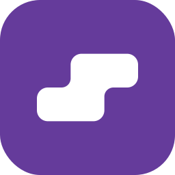

<br>
<br>
<br>
<br>
<p align="center">
  
</p>
<h1 align="center">YiTetris</h1>
<h3 align="center">Just another Tetris, simple yet faithful.</h3>

<p align="center">A clean, lightweight, and privacy-first Tetris, crafted with Material You and modern web engineering.</p>
<p align="center">Made with ❤️ by <a href="https://github.com/lingyicute">lingyicute</a>.</p>
<br>
<br>
<p align="center">
  [🇺🇸 English] •
  <a href="https://github.com/lingyicute/YiTetris">🌐 Source Code</a> •
  <a href="https://github.com/lingyicute/YiTetris/issues">🐛 Report Bug</a>
</p>

<p align="center">
  <a href="LICENSE"></a>
  <a href="index.html"></a>
  <a href="https://github.com/lingyicute/YiTetris"></a>
  <a href="https://github.com/lingyicute/YiTetris"></a>
  <a href="https://github.com/lingyicute/YiTetris"></a>
</p>
<br>

## 📖 Overview

Most browser Tetris clones get the pieces right and everything else wrong: rotation snaps through walls, the randomiser hands you four S-pieces in a row, and there is no hold, no ghost, no lock delay — so the game fights you instead of testing you.

**YiTetris** is a **faithful engine**: **SRS rotation with the full wall-kick tables**, a **7-bag randomiser**, a **3-piece next queue**, **hold**, **ghost piece**, **lock delay with reset limits** and **DAS-style auto-shift**, scored with line-clear, back-to-back and combo bonuses. It is still just **one self-contained HTML file** — canvas rendering, Material You theming and a touch pad included.

<br>

## ✨ Features

- **🧱 A Real Tetris Engine**
  - **SRS rotation** with complete wall-kick tables for `I` and `J L S T Z` — spins near walls and floors behave the way experienced players expect.
  - **7-bag randomiser** for fair, drought-free piece sequences, shown in a **3-piece next queue**.
  - **Hold slot** with the standard once-per-piece rule, plus a **ghost piece** marking the landing position.
  - **Lock delay with a reset limit**, so last-moment slides and spins are rewarded but not exploitable.
  - **DAS / auto-shift** with charged repeat, and separate soft-drop handling for precise stacking.
  - **Danger band** shading near the top of the board, and pause / resume (`P`) without losing state.

- **🏆 Scoring You Can Optimise**
  - Singles, doubles, triples and Tetrises pay **100 / 300 / 500 / 800 × level**.
  - **Back-to-back Tetris** multipliers, **combo bonuses** (+50 × combo × level), and points for **soft (+1/cell)** and **hard (+2/cell)** drops.
  - Levels rise every **10 cleared lines**; gravity tightens as **1000 × 0.8^(level−1) ms**, bottoming out at 55 ms.

- **🎚️ Four Difficulty Tiers**
  - **简单 Easy** starts at level 1, **中等 Medium** at 4, **困难 Hard** at 7, **专家 Expert** at 10 — the same engine at four very different speeds.
  - **Best score and best line count** are kept per difficulty, with a "new record" callout when you beat your best.

- **🕹️ Playable on Every Device**
  - **Desktop**: arrow keys plus `Z` (rotate CCW), `Space` (hard drop), `C` (hold), `P` (pause), `R` (restart).
  - **Mobile**: a built-in directional pad — left, soft drop, right, rotate, hard drop, hold — plus **swipe gestures** on the board with pointer capture, so drags never get lost mid-gesture.

- **🎨 Material You & Polished Design**
  - **Dynamic theming**: eight accents, and the **piece colours are derived from the accent hue**, so the entire board retints when you switch palettes.
  - Day / Night mode with the initial choice taken from `prefers-color-scheme`, a data-URI SVG favicon, `prefers-reduced-motion` support, and toast notifications for level-ups, records and state changes.
  - The board is **square and driven by a single `SIZE` constant** — change it and the game, danger band and layout follow.

- **🔒 100% Privacy, Offline & Ad-Free**
  - **Zero network requests** — no analytics, no CDN, no backend.
  - Best scores and preferences live in `localStorage` (`yitetris.*`); one menu item wipes the records.
  - Licensed under **AGPL-3.0**.

- **♿ Built to Be Usable**
  - Labelled controls, an `aria-live` toast region, and an in-game help panel listing every key.
  - Canvas internals follow the theme tokens for board background, cell colour, ghost opacity and slot hints.

<br>

## 🛠️ Why YiTetris? (Under the Hood)

### 1. Faithful Mechanics, Not an Approximation
Rotation uses SRS kick tables rather than a naive "try four offsets" loop, the piece sequence is a true 7-bag, and locking is governed by a lock delay with a bounded number of resets. These are the details that separate a Tetris you play for five minutes from one you play for an hour, and they are all implemented in plain JavaScript with no engine, no framework and no WASM.

### 2. Canvas Rendering with Themed Primitives
The board is drawn on a `<canvas>` with rounded-rectangle cells, and every colour — board background, empty cell, ghost outline, danger band — is pulled from the current Material palette. Switching accents rebuilds the piece colours too, so the stack always looks of a piece with the interface around it.

### 3. Self-Contained, Tool-Assisted Fonts
The page uses a single inline SVG sprite for every icon and an inline data-URI SVG for the favicon, so there is nothing to request. The "Nebulove" typeface is subset and embedded by `scripts/subset_font.py`, which strips comments and non-rendering text, collects exactly the glyphs the page can display, and writes the base64 WOFF2 back into the HTML:

```bash
pip install fonttools brotli
python3 scripts/subset_font.py --check    # report only
python3 scripts/subset_font.py            # subset in place
```

<br>

## 🚀 Play It Now

There is nothing to install — the game *is* one HTML file.

### Option 1 — Just open it
Download `index.html` (or clone the repository) and double-click the file. It works straight from disk, offline.

### Option 2 — Serve it locally
```bash
git clone https://github.com/lingyicute/YiTetris.git
cd YiTetris
python3 -m http.server 8000     # then open http://localhost:8000
```

### Option 3 — Publish it anywhere
Drop `index.html` on GitHub Pages, Cloudflare Pages, Netlify or any static host — a single file is the entire deployment.

<br>

## 🔨 Building from Source

There is no build step: `index.html` is the source *and* the artifact.

1. **Clone the repository**:
   ```bash
   git clone https://github.com/lingyicute/YiTetris.git
   cd YiTetris
   ```

2. **Edit and reload** — the script is split by banner comments (icons and layout, colour system, shapes and SRS kicks, game state and loop, input, rendering, dialogs). The `SIZE` constant changes the board dimensions, and `DIFFS` defines the four starting-level tiers.

3. **Refresh the embedded font (optional)** — after changing UI copy, re-subset the inlined typeface so new glyphs are included:
   ```bash
   pip install fonttools brotli
   python3 scripts/subset_font.py
   ```

<br>

## 🤗 Contributing

Contributions are always welcome!
- **Bug Reports & Feature Requests**: submit an issue on the [GitHub Issue Tracker](https://github.com/lingyicute/YiTetris/issues).
- **Pull Requests**: keep the single-file, zero-dependency philosophy intact and match the existing code style.
- **Translations**: the interface is currently Simplified Chinese — an i18n layer plus translated string tables would be very welcome.

<br>

## 📄 License

```text
Copyright (C) 2026 lingyicute <li@92li.uk>

This program is free software: you can redistribute it and/or modify
it under the terms of the GNU Affero General Public License as published by
the Free Software Foundation, either version 3 of the License, or
(at your option) any later version.

This program is distributed in the hope that it will be useful,
but WITHOUT ANY WARRANTY; without even the implied warranty of
MERCHANTABILITY or FITNESS FOR A PARTICULAR PURPOSE. See the
GNU Affero General Public License for more details.

You should have received a copy of the GNU Affero General Public License
along with this program. If not, see <https://www.gnu.org/licenses/>.
```
